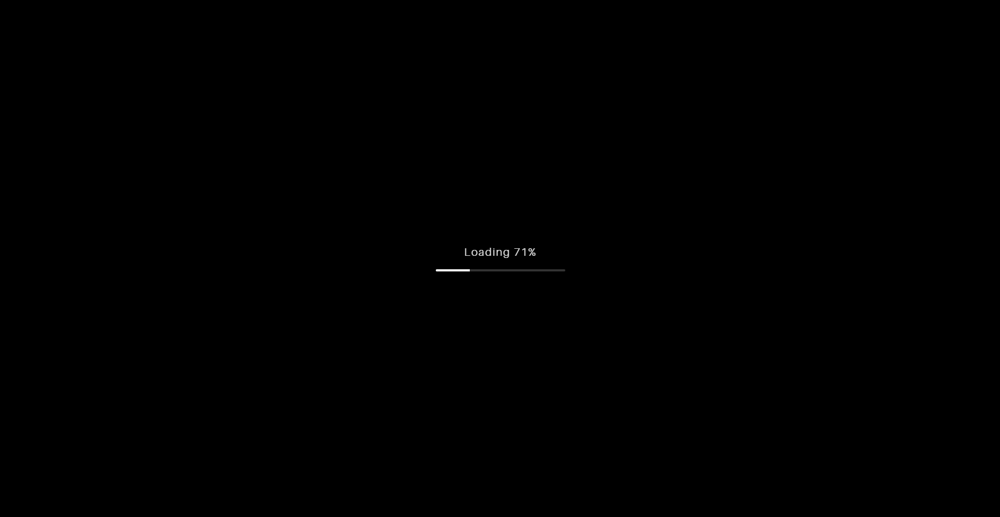
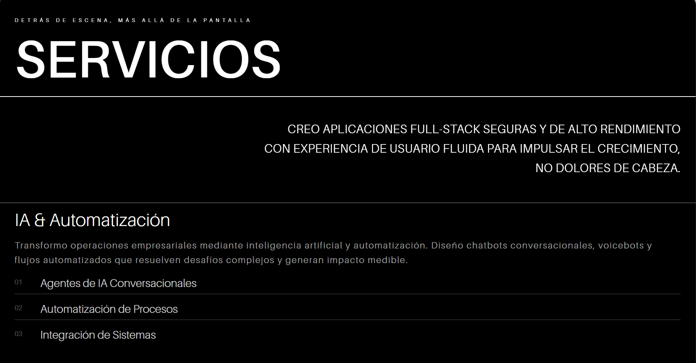
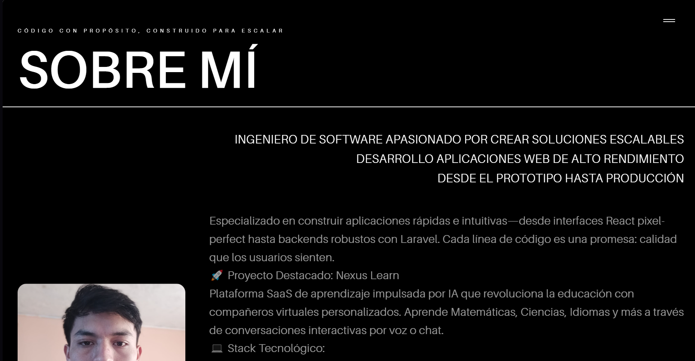
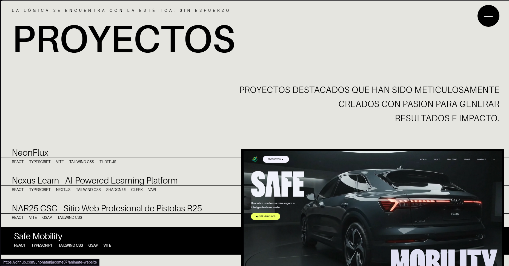
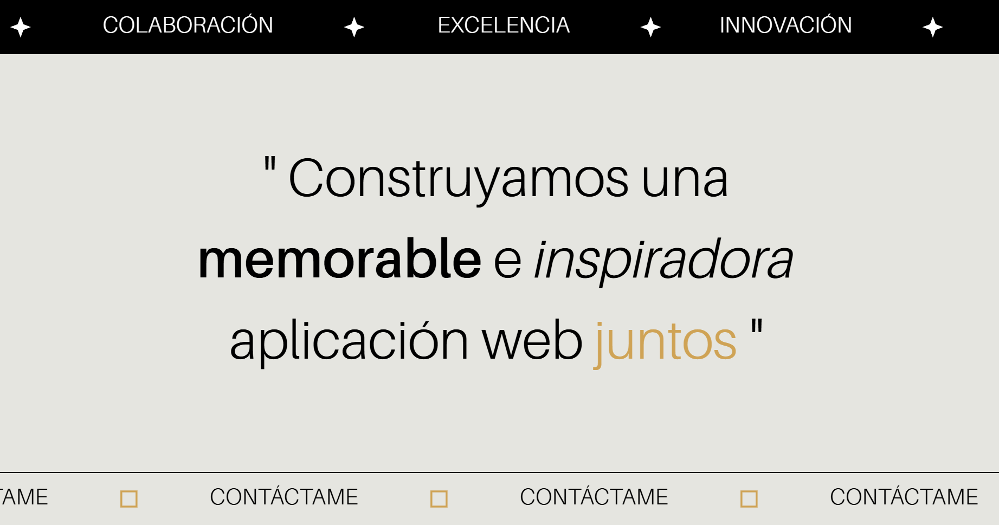
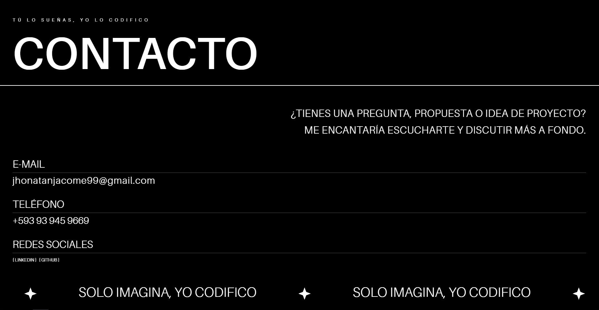

# 🌐 Portafolio de Desarrollador 3D - Jhonatan Jacome

**Construido con React, TypeScript, GSAP, Three.js, TailwindCSS, Sanity CMS e i18next**

Este es un portafolio de desarrollador completamente animado, interactivo y en 3D con **sistema de blog integrado** y **soporte multiidioma**, diseñado para impresionar a clientes, reclutadores y gerentes de contratación. Es más que un portafolio—es una experiencia web construida con código de nivel de producción, animaciones basadas en scroll, y mejores prácticas del mundo real.

⚡ **Inspirado en sitios de nivel Awwwards** — construido con React (Vite), TypeScript, TailwindCSS, GSAP, React Three Fiber, Sanity CMS e i18next.

---

## 📸 Vista Previa

<div align="center">
  
  <p><em>Hero Section con planeta 3D animado</em></p>
</div>

<div align="center">
  
  <p><em>Sección de Servicios con animaciones de scroll</em></p>
</div>

<div align="center">
  
  <p><em>Sección Sobre Mí con reveal de imagen</em></p>
</div>

<div align="center">
  
  <p><em>Proyectos con overlays interactivos</em></p>
</div>

<div align="center">
  
  <p><em>Contact Summary con marquees animados</em></p>
</div>

<div align="center">
  
  <p><em>Sección de Contacto</em></p>
</div>

---

## 🚀 Stack Tecnológico

### Core
| Tecnología | Descripción |
|------------|-------------|
| **React 18 (Vite)** | Servidor de desarrollo rápido y bundling de producción |
| **TypeScript** | Tipado estático para código más robusto y mantenible |
| **Tailwind CSS v4** | Framework de utilidades para estilos de componentes |

### Animaciones & 3D
| Tecnología | Descripción |
|------------|-------------|
| **GSAP** | Lógica de animación y movimiento basado en scroll |
| **Three.js** | Escenas 3D potenciadas por React Three Fiber |
| **Drei** | Helpers útiles para renderizado 3D |
| **Lenis** | Smooth scroll suave y natural |
| **React Scroll** | Navegación suave entre secciones |

### CMS & i18n
| Tecnología | Descripción |
|------------|-------------|
| **Sanity CMS** | Sistema de gestión de contenido headless para el blog |
| **@sanity/image-url** | Optimización de imágenes de Sanity |
| **@portabletext/react** | Renderizado de contenido rico de Sanity |
| **i18next** | Internacionalización (Español/Inglés) |
| **react-i18next** | Integración de i18next con React |

### Routing
| Tecnología | Descripción |
|------------|-------------|
| **React Router DOM** | Navegación entre páginas (Home, Blog, Post) |

---

## 📁 Características

### Portafolio
- 🔥 **Hero Section 3D** con planeta animado y anillo dorado
- 🧩 **Navbar suave** con animaciones escalonadas de links
- 🎯 **Service Summary** con movimiento horizontal de palabras activado por scroll
- 🖼️ **Sección Works** con overlays hover y previews interactivos
- ✍️ **Sección About** con reveal de imagen clip-path + texto animado
- 🎨 **Tech Stack Section** con logos de tecnologías organizados por categoría
- 🏁 **Contact Summary** basado en Marquee con CTA
- 💼 **Completamente responsive** y accesible en todos los tamaños de pantalla

### Blog (Nuevo ✨)
- 📝 **Sistema de blog completo** con Sanity CMS
- 🌐 **Contenido multiidioma** (Español/Inglés) para posts
- 📂 **Categorías y tags** para organizar posts
- 🖼️ **Soporte para imágenes** con optimización automática
- 🎬 **Galerías de imágenes** y videos embebidos (YouTube/Vimeo)
- 🔗 **Enlaces externos** (GitHub, YouTube, Hugging Face, etc.)
- ⭐ **Posts destacados** en la página principal
- 🎨 **Portable Text** para contenido rico (headings, listas, código, etc.)
- 📱 **Diseño responsive** para móviles y tablets

### Internacionalización (Nuevo ✨)
- 🌍 **Soporte completo para Español e Inglés**
- 🔄 **Cambio de idioma en tiempo real** con toggle flotante
- 📝 **Traducciones para todo el contenido** del portafolio y blog
- 💾 **Persistencia del idioma** seleccionado

---

## 📦 Instalación y Configuración

### Prerrequisitos
- Node.js 18+ instalado
- npm o yarn
- Cuenta de Sanity (gratis en [sanity.io](https://www.sanity.io))

### Pasos de Instalación

```bash
# 1. Clonar el repositorio
git clone https://github.com/Jhonatanjacome07/jhonatanjacome-dev.git

# 2. Navegar al directorio
cd jhonatanjacome-dev

# 3. Instalar dependencias
npm install

# 4. Configurar variables de entorno
cp .env.example .env.local
```

### Configuración de Sanity CMS

#### 1. Crear proyecto en Sanity

```bash
# Iniciar sesión en Sanity
npx sanity login

# El proyecto ya está configurado, solo necesitas las credenciales
```

#### 2. Configurar variables de entorno

Edita `.env.local` con tus credenciales de Sanity:

```env
# Sanity Configuration
VITE_SANITY_PROJECT_ID=tu-project-id
VITE_SANITY_DATASET=production
VITE_SANITY_API_VERSION=2024-01-01
```

> **Nota**: Puedes obtener tu `PROJECT_ID` en [manage.sanity.io](https://manage.sanity.io)

#### 3. Configurar CORS en Sanity

1. Ve a [manage.sanity.io](https://manage.sanity.io)
2. Selecciona tu proyecto
3. Ve a **API** → **CORS Origins**
4. Agrega los siguientes orígenes:
   ```
   http://localhost:5173
   http://localhost:5174
   https://tu-dominio.vercel.app
   ```
5. Marca "Allow credentials" para cada uno

### Scripts Disponibles

```bash
# Desarrollo del portafolio
npm run dev

# Sanity Studio (editor de blog)
npm run studio

# Build de producción
npm run build

# Preview del build
npm run preview

# Desplegar Sanity Studio
npm run studio:deploy

# Linting
npm run lint
```

---

## 📂 Estructura del Proyecto

```
portafolio/
├── public/
│   ├── fonts/              # Fuentes Amiamie
│   ├── images/             # Imágenes del portafolio
│   ├── models/             # Modelos 3D (.glb)
│   └── videos/             # Videos de fondo
├── sanity/
│   └── schemas/            # Schemas de Sanity CMS
│       ├── index.ts        # Registro de schemas
│       ├── post.ts         # Schema de posts del blog
│       └── category.ts     # Schema de categorías
├── src/
│   ├── components/         # Componentes reutilizables
│   │   ├── blog/           # Componentes del blog
│   │   │   ├── BlogCard.tsx
│   │   │   ├── BlogGrid.tsx
│   │   │   ├── MediaGallery.tsx
│   │   │   └── PortableTextRenderer.tsx
│   │   ├── FloatingLanguageToggle.tsx
│   │   ├── LoadingScreen.tsx
│   │   └── ...
│   ├── constants/          # Datos centralizados
│   │   └── index.ts
│   ├── i18n/               # Configuración de internacionalización
│   │   ├── config.ts       # Configuración de i18next
│   │   └── locales/        # Archivos de traducción
│   │       ├── es.json     # Traducciones en Español
│   │       └── en.json     # Traducciones en Inglés
│   ├── lib/
│   │   └── sanity/         # Utilidades de Sanity
│   │       ├── client.ts   # Cliente de Sanity
│   │       ├── image.ts    # Helper para imágenes
│   │       ├── queries.ts  # Queries GROQ
│   │       └── utils.ts    # Funciones auxiliares
│   ├── pages/              # Páginas de la aplicación
│   │   ├── HomePage.tsx    # Página principal
│   │   ├── Blog.tsx        # Lista de posts
│   │   └── BlogPost.tsx    # Post individual
│   ├── sections/           # Secciones principales
│   │   ├── Hero.tsx
│   │   ├── Services.tsx
│   │   ├── About.tsx
│   │   ├── Works.tsx
│   │   ├── TechStack.tsx
│   │   ├── BlogPreviewSection.tsx
│   │   ├── ContactSummary.tsx
│   │   ├── Contact.tsx
│   │   └── Navbar.tsx
│   ├── types/              # Tipos de TypeScript
│   │   └── blog.ts         # Tipos del blog
│   ├── App.tsx             # Componente principal
│   ├── index.css           # Estilos globales
│   └── main.tsx            # Punto de entrada
├── .env.example            # Ejemplo de variables de entorno
├── .env.local              # Variables de entorno (no se sube a Git)
├── sanity.config.ts        # Configuración de Sanity Studio
├── sanity.cli.ts           # CLI de Sanity
├── vite.config.ts          # Configuración de Vite
├── tailwind.config.js      # Configuración de Tailwind
└── package.json
```

---

## 🛠️ Personalización

### Actualizar Contenido del Portafolio

#### Datos Personales
Edita `/src/constants/index.ts`:
- **Información personal**: Actualiza `aboutData`
- **Proyectos**: Modifica el array `projects`
- **Redes sociales**: Actualiza el array `socials`
- **Servicios**: Modifica `services`

#### Traducciones
Edita los archivos en `/src/i18n/locales/`:
- **Español**: `es.json`
- **Inglés**: `en.json`

### Gestionar el Blog

#### Acceder al Editor (Sanity Studio)

```bash
# Opción 1: Local
npm run studio
# Abre http://localhost:3333

# Opción 2: En la nube (después de desplegar)
# Visita https://tu-proyecto.sanity.studio
```

#### Crear un Post

1. Abre Sanity Studio
2. Click en "Blog Post" → "Create"
3. Llena los campos:
   - **Title (ES/EN)**: Título en ambos idiomas
   - **Slug**: Click en "Generate"
   - **Main Image**: Sube una imagen principal
   - **Excerpt (ES/EN)**: Resumen corto
   - **Content (ES/EN)**: Contenido completo con formato
   - **Category**: Selecciona o crea una categoría
   - **Tags**: Agrega tags separados por comas
   - **Featured**: Marca si quieres que aparezca en la home
4. Click en "Publish"

#### Crear una Categoría

1. En Sanity Studio, ve a "Category" → "Create"
2. Llena los campos:
   - **Title (ES/EN)**: Nombre de la categoría
   - **Slug**: Click en "Generate"
   - **Color**: Código hexadecimal (ej: `#3B82F6`)
3. Click en "Publish"

### Modificar Escenas 3D
- **Modelo del planeta**: Edita `/src/components/Planet.tsx`
- **Configuración de la escena**: Ajusta `/src/sections/Hero.tsx`

### Estilos y Colores
- **Configuración de Tailwind**: `tailwind.config.js`
- **Fuentes personalizadas**: `/src/index.css`
- **Colores del tema**: Definidos en `@theme` en `index.css`

```css
@theme {
  --color-primary: #e5e5e0;
  --color-DarkLava: #393632;
  --color-SageGray: #8b8b73;
  --color-gold: #cfa355;
  /* Agrega tus propios colores aquí */
}
```

---

## 🎨 Secciones del Portafolio

### 1. **Hero**
- Planeta 3D interactivo con Three.js
- Animaciones GSAP de entrada
- Texto animado con SplitText
- Loading screen con progreso

### 2. **Services**
- Cards con efecto sticky scroll
- Animaciones de clip-path
- Diseño responsive
- 4 servicios principales

### 3. **Works**
- Grid de proyectos interactivo
- Preview flotante en hover (desktop)
- Links a repositorios de GitHub
- Imágenes optimizadas

### 4. **Tech Stack** (Nuevo ✨)
- Logos de tecnologías organizados por categoría
- Frontend, Backend, Databases, Tools
- Diseño en grid responsive

### 5. **About**
- Imagen con reveal animado
- Contenido dinámico desde constants
- Stack tecnológico categorizado
- Proyecto destacado

### 6. **Blog Preview** (Nuevo ✨)
- Muestra los 3 posts destacados
- Cards con imagen, categoría y excerpt
- Link a la página completa del blog
- Soporte multiidioma

### 7. **Contact Summary**
- Marquees animados con GSAP
- Valores de marca
- Call-to-action destacado

### 8. **Contact**
- Información de contacto
- Links a redes sociales
- Marquee inferior animado

---

## 🌐 Rutas de la Aplicación

| Ruta | Descripción |
|------|-------------|
| `/` | Página principal con todas las secciones |
| `/blog` | Lista de todos los posts del blog |
| `/blog/:slug` | Post individual del blog |

---

## 🚀 Despliegue

### Desplegar en Vercel

1. **Conecta tu repositorio** a Vercel
2. **Configura las variables de entorno**:
   ```
   VITE_SANITY_PROJECT_ID=tu-project-id
   VITE_SANITY_DATASET=production
   VITE_SANITY_API_VERSION=2024-01-01
   ```
3. **Despliega** automáticamente con cada push

### Desplegar Sanity Studio

```bash
npm run studio:deploy
```

Esto desplegará tu Studio a `https://tu-proyecto.sanity.studio`

### Configurar CORS para Producción

1. Ve a [manage.sanity.io](https://manage.sanity.io)
2. Agrega tu dominio de producción a CORS Origins:
   ```
   https://tu-dominio.vercel.app
   ```

---

## 🔒 Seguridad

### Variables de Entorno

El archivo `.env.local` **NO se sube a Git** (está en `.gitignore`). Las credenciales de Sanity son públicas por diseño (solo permiten lectura), pero el Studio requiere autenticación.

### Acceso al Studio

Solo tú puedes editar el blog. El Studio requiere iniciar sesión con tu cuenta de Sanity (Google/GitHub).

---

## 📝 Tecnologías y Conceptos Aprendidos

Este proyecto demuestra conocimiento en:

- ✅ **React 18** con hooks modernos (useState, useEffect, useRef, custom hooks)
- ✅ **TypeScript** con tipos estrictos e interfaces
- ✅ **GSAP** para animaciones complejas y ScrollTrigger
- ✅ **Three.js** para renderizado 3D con React Three Fiber
- ✅ **Tailwind CSS v4** con configuración personalizada
- ✅ **Sanity CMS** como headless CMS
- ✅ **i18next** para internacionalización
- ✅ **React Router** para navegación SPA
- ✅ **Vite** como build tool moderno
- ✅ **Responsive Design** mobile-first
- ✅ **Performance optimization** (lazy loading, code splitting)
- ✅ **Git** y control de versiones

---

## 🤝 Contribuciones

Este es un proyecto personal, pero sugerencias y feedback son bienvenidos. Siéntete libre de abrir un issue o contactarme directamente.

---

## 📧 Contacto

- **Email**: jhonatanjacome99@gmail.com
- **LinkedIn**: [Jhonatan Jacome](https://www.linkedin.com/in/jhonatan-jacome-/)
- **GitHub**: [@Jhonatanjacome07](https://github.com/Jhonatanjacome07)
- **Portafolio**: [jhonatanjacome](https://jhonatanjacome.vercel.app)

---

## 📄 Licencia

Este proyecto está bajo la Licencia MIT. Ver el archivo `LICENSE` para más detalles.

---

<div align="center">
  <p>Hecho con ❤️ por Jhonatan Jacome</p>
  <p>⚡ Inspirado en sitios de nivel Awwwards</p>
  <p>🚀 Construido con las mejores prácticas de desarrollo web</p>
</div>
